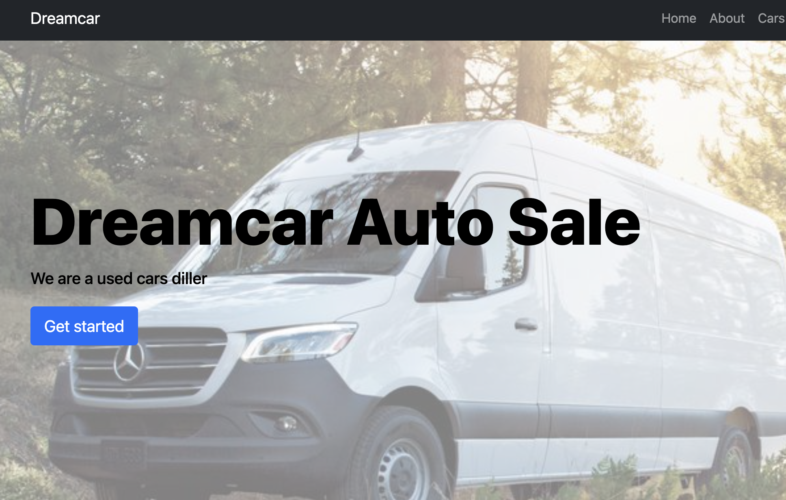

# Dreamcar Auto Sale - A used cars Diller

## This is an inventory displaying website for USA customers, which is a diller for Mercedes Sprinters and other VANs.

### In this project I used React JS with hooks:
- `useState()`
- `useEffect()`
- `useSelector()`
- `useDispatch()`
- 

## Interesting features implemented:
- Created the contact form by using `useState()` hook to handle all inputs
- Used `useEffect()` hook to monitor any changes in inputs and save in `localStore`
- Used conditional rendering, when the form is submitted (display success message)
- Implemented `Redux` for React
- Used `useSelector()` and `useDispatch()` hooks for working with Redux

## The [Demo Live](https://dreamcarsautosales.com/) version is available

## Project status: on going

### Built with

- React JS
- React Bootstrap
- Netlify

### Run project on local machine

- copy and run this command to your terminal `git clone https://github.com/elmar8287/dreamcar-auto-sales.git`
- switch to right directory by `cd dreamcar-auto-sales`
- instal npm by running this command `npm i`
- start the project by running this command `npm start`

## Author

- GitHub: [@elmar8287](https://github.com/elmar8287)
- LinkedIn: [Elmar Abdulkarimov](https://www.linkedin.com/in/elmar.abdulkarimov/)

## 🤝 Contributing

Contributions, issues, and feature requests are welcome!

Feel free to check the [issues page](https://github.com/elmar8287/dreamcar-auto-sales/issues).

## Show your support

Give a ⭐️ if you like this project!

License could be find [here](https://github.com/elmar8287/dreamcar-auto-sales/blob/dev/LICENSE)
